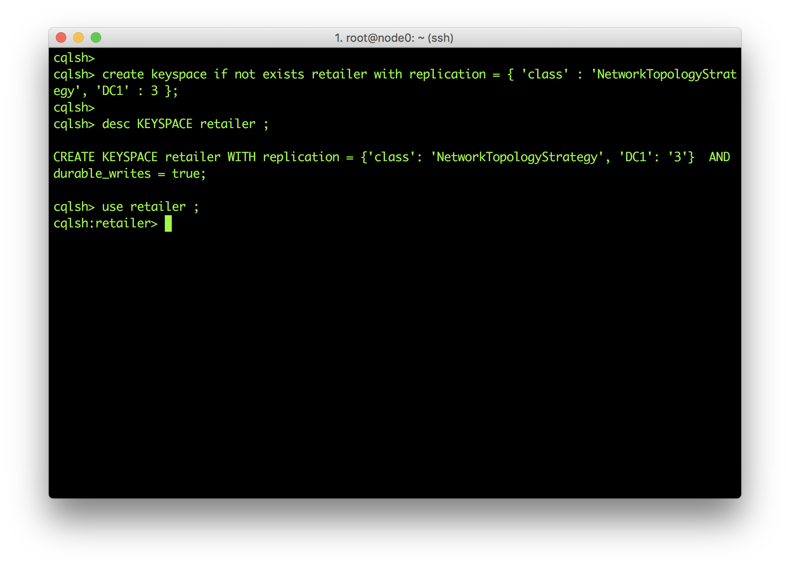
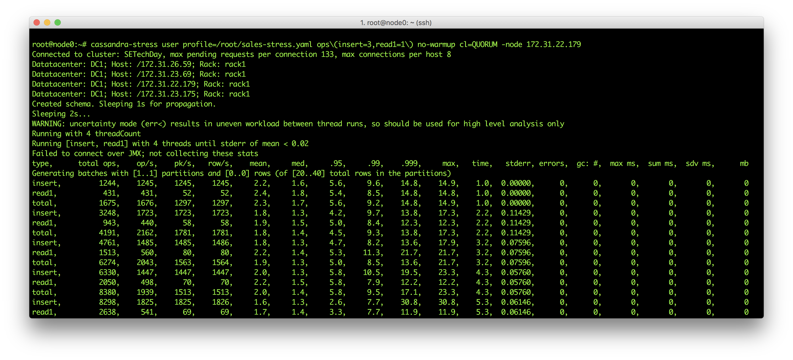
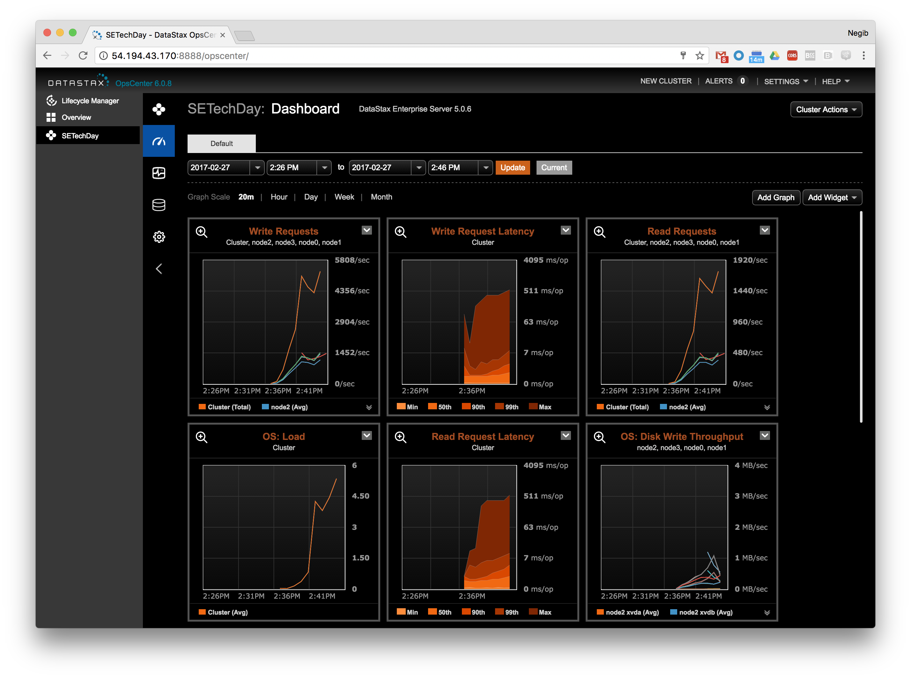

**[Back to Agenda](./../README.md)**

# Lab 2 - CQL

Use SSH to connect to one of your nodes.  We're now going to start the cqlsh client.

And before we go on, a quick explanation of what CQL, CQLSH and other aspects of Cassandra and DataStax Enterprise is in order:

The Cassandra Query Language (CQL) is the primary language for communicating with the Cassandra database. The most basic way to interact with Cassandra is using the CQL shell, cqlsh. Using cqlsh, you can create keyspaces and tables, insert and query tables, plus much more. If you prefer a graphical tool, you can use DataStax DevCenter. For production, DataStax supplies a number of drivers so that CQL statements can be passed from client to cluster and back.

To start the cqlsh client run the command:

```
# use the specific connected node name or `hostname -I`

cqlsh node0
```


Let's make our first Cassandra Keyspace! If you are using uppercase letters, use double quotes around the keyspace.

```

CREATE KEYSPACE <Enter your firstname/name> WITH replication = {'class': 'NetworkTopologyStrategy', 'DC1': 3 };

```



And just like that, any data within any table you create under your keyspace will automatically be replicated 3 times. Let's keep going and create ourselves a table. You can follow my example or be a rebel and roll your own.

```
use <yourkeyspace>;

CREATE TABLE sales_by_customer (
    custid int,
    salesdt text,
    comment text,
    discount double,
    longlat text,
    postalcode text,
    revenue double,
    sentiment text,
    PRIMARY KEY (custid, salesdt)
)

```

**/

Yup. This table is very simple but don't worry, we'll play with some more interesting tables in just a minute.

Let's get some data into your table! Cut and paste these inserts into DevCenter or CQLSH. Feel free to insert your own data values, as well.

```
INSERT INTO sales_by_customer (custid, salesdt, revenue, discount, comment) VALUES (1, '2017-02-11', 299.0, 0, 'Microsoft Xbox');
INSERT INTO sales_by_customer (custid, salesdt, revenue, discount, comment) VALUES (2, '2017-02-12', 1999.0, 20, 'Microsoft Surface');
INSERT INTO sales_by_customer (custid, salesdt, revenue, discount, comment) VALUES (1, '2017-02-13',  1499.00, 15, 'iMac');
INSERT INTO sales_by_customer (custid, salesdt, revenue, discount, comment) VALUES (1, '2017-10-04', 399.0, 12.5, 'PlayStation 4');
INSERT INTO sales_by_customer (custid, salesdt, revenue, discount, comment) VALUES (2, '2017-02-15', 560.0, 15, 'AppleWatch');
```

Now, to retrieve data from the database run:

```  

select * from sales_by_customer WHERE custid=1 AND salesdt >='2017-01-01';

```


See what I did there? You can do range scans on clustering keys! Give it a try.

Hey you can also use standard aggregate functions.

```  
select custid, sum(revenue) from sales_by_customer group by custid, salesdt';

```

If you have time checkout the Upsert, the TTL and LWT.

1. What happens if you insert the same rows multiple times?
2. Insert a new partition with the TTL of 10 seconds.
3. Insert a duplicate row of the available partitions with IF NOT EXISTS statement. What can you see?
4. What happens when you insert a NULL value?


Let's put some workload on the cluster.
Cassandra stress is a tool which can be used to verify the scalability and latency performance of a specific keyspace and table.

We've prepared a cassandra-stress profile to customize the workload as we would expect it in the system.

Login in On one of the nodes of your cluster and copy the casstress-sales.yaml profile. Add your keyspace to it.

```
vi casstress-sales.yaml
```
Copy the content to the file.

```
# Keyspace Name
keyspace: <your_keyspace>

# Table name
table: stress_sales_by_customer

# The CQL for creating a table you wish to stress (optional if it already exists)
table_definition:
  create table stress_sales_by_customer (
        custid int,
        salesdt text,
        comment text,
        discount double,
        longlat text,
        postalcode text,
        revenue double,
        sentiment text,
        PRIMARY KEY (custid, salesdt)
    )

### Column Distribution Specifications ###

columnspec:
- name: custid
  size: uniform(10..30)
- name: salesdt
  cluster: uniform(20...40)
- name: revenue
  cluster: uniform(3...5)
- name: discount
  size: uniform(1..2)
- name: comment
  size: uniform(10..30)

#
# A list of queries you wish to run against the schema
#
queries:
   read1:
    cql: SELECT * FROM stress_sales_by_customer WHERE custid = ?
    fields: samerow
   read1:
    cql: SELECT * FROM stress_sales_by_customer WHERE custid = ? AND salesdt = ?
    fields: samerow
   read1:
    cql: SELECT * FROM stress_sales_by_customer WHERE custid = ? AND salesdt >= ? AND salesdt <= ?
    fields: samerow
```

To start cassandra-stress you can use the following command:  
**Please note that you have to put your IP address of one of your cluster nodes for the *-node* parameter**

```   

cassandra-stress user profile=/<path_to_file>/casstress-sales.yaml ops\(insert=3,read1=1\) no-warmup cl=LOCAL_ONE -node 172.31.22.179

```



Now you can start monitoring your cluster via OpsCenter: http://<cluster_node1_ip>:8888/opscenter/



For further assistance and to create a more complex stress yaml file please consult the following page:   
**[Cassandra Stress Data Modeler](http://www.sestevez.com/sestevez/CassandraDataModeler/)**

## Extra Credit

In addition to the command line cqlsh, DataStax offers a product called DevCenter.  You can download DevCenter, connect to your cluster and run queries using that IDE environment.  DevCenter is available for download at [https://academy.datastax.com/downloads](https://academy.datastax.com/downloads).

**[Back to Agenda](./../README.md)**
