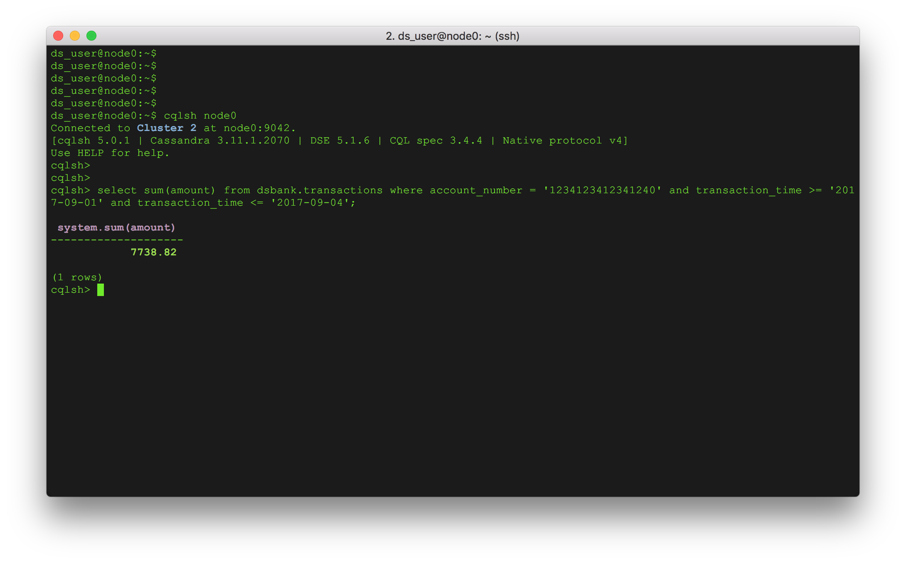

**[Back to Agenda](./../README.md)**

# Lab 2 - CQL

Use SSH to connect to one of your nodes.  We're now going to start the cqlsh client.

And before we go on, a quick explanation of what CQL, CQLSH and other aspects of Cassandra and DataStax Enterprise is in order:

The Cassandra Query Language (CQL) is the primary language for communicating with the Cassandra database. The most basic way to interact with Cassandra is using the CQL shell, cqlsh. Using cqlsh, you can create keyspaces and tables, insert and query tables, plus much more. If you prefer a graphical tool, you can use DataStax DevCenter. For production, DataStax supplies a number of drivers so that CQL statements can be passed from client to cluster and back.

To start the cqlsh client run the command:

```
# use the specific connected node name or `hostname -I`

cqlsh node0
```


Let's make our first Cassandra Keyspace! If you are using uppercase letters, use double quotes around the keyspace.

```

create keyspace if not exists retailer with replication = { 'class' : 'NetworkTopologyStrategy', 'DC1' : 3 };

```


And just like that, any data within any table you create under your keyspace will automatically be replicated 3 times. Let's keep going and create ourselves a table. You can follow my example or be a rebel and roll your own.

```
use retailer;

CREATE TABLE retailer.sales (
    name text,
    dt   date,
    item text,
    qty   int,
    price double,
    rev   double,
    PRIMARY KEY (name, dt)
) WITH CLUSTERING ORDER BY ( dt DESC );
```


Yup. This table is very simple but don't worry, we'll play with some more interesting tables in just a minute.

Let's get some data into your table! Cut and paste these inserts into DevCenter or CQLSH. Feel free to insert your own data values, as well.

```
INSERT INTO retailer.sales (name, dt, item, qty, price, rev) VALUES ('gregg', '2017-02-11', 'Microsoft Xbox', 1, 299.00, 299.00);
INSERT INTO retailer.sales (name, dt, item, qty, price, rev) VALUES ('schnack', '2017-02-12','Microsoft Surface', 1, 1999.00,1999.00);
INSERT INTO retailer.sales (name, dt, item, qty, price, rev) VALUES ('gregg', '2017-02-13', 'iMac', 1, 1499.00,1499.00);
INSERT INTO retailer.sales (name, dt, item, qty, price, rev) VALUES ('gregg', '2017-10-04', 'PlayStation 4', 1, 399.00,399.00);
INSERT INTO retailer.sales (name, dt, item, qty, price, rev) VALUES ('schnack', '2017-02-15', 'AppleWatch', 1, 799.00,799.00);
```


Now, to retrieve data from the database run:

```  

SELECT * FROM retailer.sales WHERE name='gregg' AND dt >='2017-01-01';

```



See what I did there? You can do range scans on clustering keys! Give it a try.


Let's put some workload on the cluster.
Cassandra stress is a tool which can be used to verify the scalability and latency performance of a specific keyspace and table.

We've prepared a cassandra-stress profile to customize the workload as we would expect it in the system.

On node0 you'll find the casstress-sales.yaml profile for our example.

```
# Keyspace Name
keyspace: retailer

# The CQL for creating a keyspace (optional if it already exists)
keyspace_definition: |
  CREATE KEYSPACE retailer WITH replication = {'class': 'NetworkTopologyStrategy', 'DC1': 3};

# Table name
table: sales

# The CQL for creating a table you wish to stress (optional if it already exists)
table_definition:
  create table sales (
    name text,
    dt   date,
    item text,
    qty   int,
    price double,
    rev   double,
    PRIMARY KEY (name, dt)
  ) WITH CLUSTERING ORDER BY ( dt DESC )
### Column Distribution Specifications ###

columnspec:
- name: name
  size: uniform(10..30)
- name: dt
  cluster: uniform(20...40)
- name: item
  size: uniform(1..32)
- name: qty
  size: uniform(1..2)
- name: price
  size: uniform(3..5)
- name: rev
  cluster: uniform(3...5)

#
# A list of queries you wish to run against the schema
#
queries:
   read1:
    cql: SELECT * FROM sales WHERE name = ?
    fields: samerow
   read1:
    cql: SELECT * FROM sales WHERE name = ? AND dt = ?
    fields: samerow
   read1:
    cql: SELECT * FROM sales WHERE name = ? AND dt >= ? AND dt <= ?
    fields: samerow
```

To start cassandra-stress you can use the following command:  
**Please note that you have to put your IP address of one of your cluster nodes for the *-node* parameter**

```   

cassandra-stress user profile=/root/casstress-sales.yaml ops\(insert=3,read1=1\) no-warmup cl=QUORUM -node 172.31.22.179

```


Now you can start monitoring your cluster via OpsCenter: http://54.194.43.170:8888/opscenter/


## Extra Credit

In addition to the command line cqlsh, DataStax offers a product called DevCenter.  You can download DevCenter, connect to your cluster and run queries using that IDE environment.  DevCenter is available for download at [https://academy.datastax.com/downloads](https://academy.datastax.com/downloads).

**[Back to Agenda](./../README.md)**
